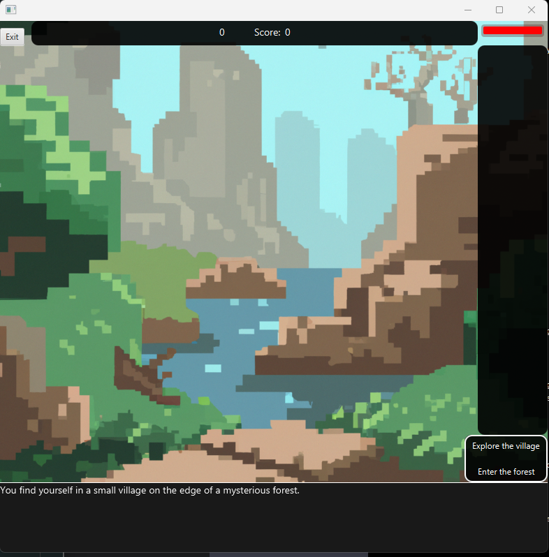
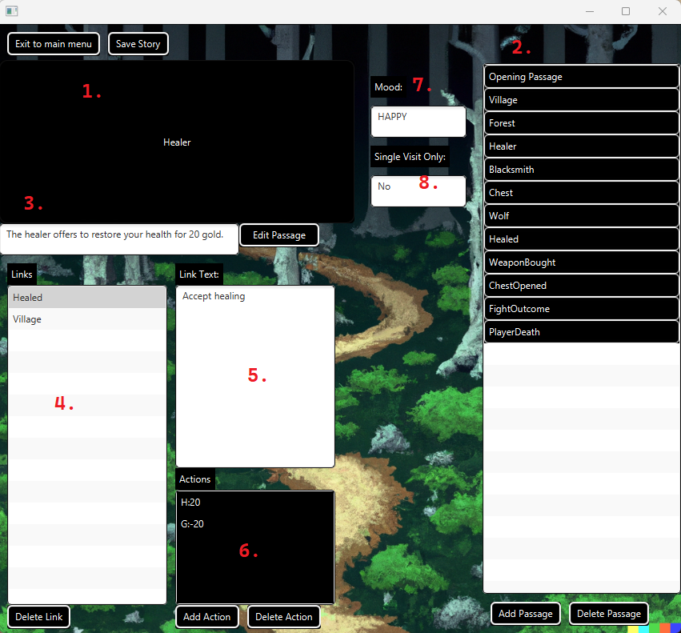

# Paths

Welcome to Paths, a JavaFX adventure game featuring complex functionality and possibilities to make your own stories
and play them!

**Table of Contents**

1. [Introduction](#Paths)
2. [Requirements](#Requirements)
3. [Installation](#Installation)
4. [Usage](#Usage)
    1. [How to Start and Play a Game](#How-to-start-and-play-a-game)
    2. [How to Save and Load a Game](#How-to-save-and-load-a-game)
    3. [How to Debug and Read Story Info](#How-to-debug-and-read-story-info)
    4. [How to Edit a Story](#How-to-edit-a-story)
    5. [How to Add Custom Images and Sounds to a Passage](#How-to-add-custom-images-and-sounds-to-a-passage)
    6. [How to Create a New Story](#How-to-create-a-new-story)
    7. [How to Use the Story Creator](#How-to-use-the-story-creator)
5. [Game Structure](#Game-structure)
    1. [Game Endings](#Game-endings)
    2. [Story Extensions](#Story-extensions)
        1. [Story Type Conversion](#Story-type-conversion)
6. [License](#License)

## Requirements

- Java JDK 17 or higher
- Git
- Maven

## Installation

1. Clone the repository
2. Open a terminal in the repository folder
3. Run 'mvn javafx:run'

## Usage

### How to start and play a game

1. In the main menu. Click 'New game' to start a new game or 'Load game' to load a saved game.

2. Select a story to play. The different extensions of the story are shown in the dropdown menu.
   Read more about the extensions under Story Extensions in Game Structure.))

3. (OPTIONAL) After choosing a story, you can choose custom settings for a game. Goals and Start values can be edited.
   The goals
   will not affect the game, but show you if you reach the goals when you encounter a game-ending passage.

4. Fill in the player name field and click 'Start game'

5. 
   The scene you are now seeing is the games opening passage. It is the first passage of the story and is always shown
   when you start a game.
   See the picture for information of where the objects listed are
    1. Content bar: This bar shows the content of the passage. It is plain text and is animated and can be skipped when
       clicked.
    2. Link choices: This is a list of links that take you to another passage. The links are shown as buttons and can be
       clicked to go to the passage.
       See Game Structure further down for additional information on links and the game structure.
    3. Inventory: This is a list of items that you have collected.
       Items do not currently have any special functionality other than being displayed as text or images.
    4. Player name: This is the name of the player. It is shown in the top left corner of the screen.
    5. Health bar: This is the health bar of the player. It is shown in the top right corner of the screen.
    6. Gold: This is the amount of gold the player has. It is shown in the top right corner of the screen.
    7. Score: This is the score of the player. It is shown in the top right corner of the screen.
    8. Exit button: This is the exit button. It is shown in the top right corner of the screen. Clicking it will take
       you back to a dialog where you can save, exit or restart the game.

### How to save and load a game

1. When in a game.
   Click the exit button in the upper right corner.
   You will be prompted with a dialog where you can
   save, exit or restart the game.
   Click 'Save' to save the game.
   The game will be saved in recourses/games/ and will have the filename of the story.
   !!Warning!!
   Saving a story will overwrite the previous save file on that story!

2. To load a game, go to the main menu and click 'Load game'.
   Then you can choose the save file to load.
   The save files
   are located in resources/games/ and have the filename of the story.
   Click 'Load game' to load the game.

### How to debug and read story info

1. From the main menu. Click 'Stories' to see information about the saved stories.
2. You will be taken to the story overview.
   Here you can see the stories that are saved in the resources/stories/
   folder.
   You can choose a story in the choice box at the top of the screen.
   Clicking a story will show you information about
   the
   story.

   The information shown is the story name, the story file type, number of passages, and number of broken links*.
   *Broken links are links that are linking to a passage that does not exist.
   You can click the 'see broken links' button if there are any broken links.
   This will show you the broken links.

   The story type is the extension of the story.
   See Game Structure for more information on the extensions.
   The story version is the version of the story.
   This determines the features supported in your story.

   You can also select to edit a story if it is in .json format.
   If not, then you have to first convert it to .json
   format.

### How to edit a story

To edit a story.
Go to the Stories overview and choose a story in .json format.
Then click 'Edit story'.
All passages, links and actions will be shown in the story creator.
Here you can edit the story visually
and save it when you are done.

!Remember to save the story before exiting the application, it will not be saved
on exit!
The story will also overwrite the old story file!
See the section under for more information on how to
use the story creator.

### How to add custom images and sounds to a passage

Only .mp3 and .png files are supported!

1. Go to the folder resources/stories/ and find the story you want to add custom images and sounds to.
2. Open the folder with the story.
   Here you can see an images and a sounds folder.
   These are the folders where you
   can add custom images and sounds to the story.
3. To add a custom image, add a .png file to the 'images' folder.
   The image will be shown in the passage if the
   image name is the same as the passage, please only use lower case!
   (eg. passage1.png).
4. To add a custom sound, add a .mp3 file to the 'sounds' folder.
   The sound will be played when the passage is shown
   if the sound name is the same as the passage, please only use lower case!
   (eg. passage1.mp3).
5. Play the story! You don't have to restart the game!

### How to create a new story

1. To create a new story from the main menu, click 'Create your own story'.
2. You will be prompted to choose a name for the story.
   The name will be used to identify the story in the story
   overview and will be used as the name of the story file.
   !!Warning!!
   Using an existent story name will overwrite the previous story file!
3. After choosing a name, you will be taken to the story creator. The story creator is a tool to create stories
   visually. It is recommended to use the story creator to create stories, as it is easier to use than writing the
   story in a text editor. The story will be saved in a json format, which is the recommended format to use.
   It can be converted to a .paths format if needed but will lose the additional features of the json format.

#### How to use the story creator

The story creator is a tool to create stories visually.
It is recommended to use the story creator to create stories.
The story will be saved in a json format, which is the recommended format to use.
It can be converted to a .paths format if needed but will lose the additional features of the json format.

Explanation of the story creator, see the image above for reference.

The story creator is used by dragging and dropping.

1. The passage container.
   Drop a passage here from the list of passages to view and edit this passage.
   The selected
   passage title will be shown here.
2. The list of passages. Drag a passage from here to the passage container to view and edit the passage.
3. The passage content and an edit passage button. Here you can edit the passage, but not its title.
4. List of links to other passages.
   The links are represented with the Title of the passage they lead to.
   To add a link to a passage, drag a passage from the list of passages to the link container.
   To remove a link, select it and
   click 'Delete Link'.
5. The selected link text.
   Click a link in the link container to view the text.
   The actions for a link will also show.
   You can not edit the link text, but you can edit the actions.
   If you want to edit the link text, you have to
   delete the link and add a new one.
6. The list of actions for a link.
   The actions are represented with the type of action and the value of the action.
   To add an action, click 'Add action' and choose the type of action and the value.
   To remove an action, select it
   and click 'Delete action'.
   The actions are 'H' for health.
   'G' for gold.
   'S' for score.
   'I' for inventory.
   Negative values are allowed for all actions except inventory, which will then subtract from the current value.
7. The passage mood.
   The mood is a type which has images and music to it.
   This is used to easily set music and images
   for a passage.
   To add a mood, click 'Edit Passage' and choose the mood.
8. Single visit only.
   Specify if the passage can only be visited once.
   This is especially useful for ensuring
   players aren't getting the actions from a passage multiple times by revisiting it.
   And enables the creation of
   more complex stories where the user can have multiple paths to take, and the story can be different depending on
   the path the user takes.

At the bottom of the screen you can see the buttons for adding, deleting passages, as well as actions and links.

When you are done creating a story, click the 'Save Story' button to save the story.
This will overwrite the old story file!

## Game structure

A story is made up of passages.
A passage is a part of the story that is shown to the player.
A passage can have
links to other passages as well as a mood (only .json stories).
A mood is a type which has images and music
to it.
This is used to easily set music and images for a passage.
It can also have custom images and sounds!

The links in the passage are as mentioned linking to another passage.
The links also contain a list of actions
which can be a change in the players' gold, score, health or inventory.

A feature added in version 2.0.0 is a passage being single visit only.
This means that the passage can only be
visited once.
This is especially useful for ensuring players aren't getting the actions from a passage multiple times.

A link which is linking to a passage which does not exist is considered a broken link.
In the story overview,
you can see if your story contains any broken links.

### Game endings

A game is considered ended when the player reaches a passage with no links.
This is a game-ending passage and the end
screen will be shown.
Keep in mind, a story can have multiple game endings.

The game also ends if a player dies (health reaches 0), and a death screen will be shown.

### Story extensions

A story can have two different file extensions(.paths and .json).
The .paths extension is the original extension,
and the .json extension is the new extension.
The .json extension is the recommended extension to use, as it has
additional features and the story can easily be edited using the story creator.

#### Story type conversion

A story written in either format can be converted to the new format.
This is done by choosing the story in the
stories overview and clicking the 'Convert' button.
The story will then be converted to the other format.

!!Warning!!
This will overwrite the story file, so make sure to have a backup of the story before converting it.
.json stories will also LOSE all additional features which are not supported by the .paths format.

A story can be converted from .paths to .json as well.
The player will be prompted to choose moods, and if the
passage only supports a single visit for all passages in the story.
The story will then be converted to the .json
format.

## License

This project is licensed under the MIT License. See License.txt for more information.
