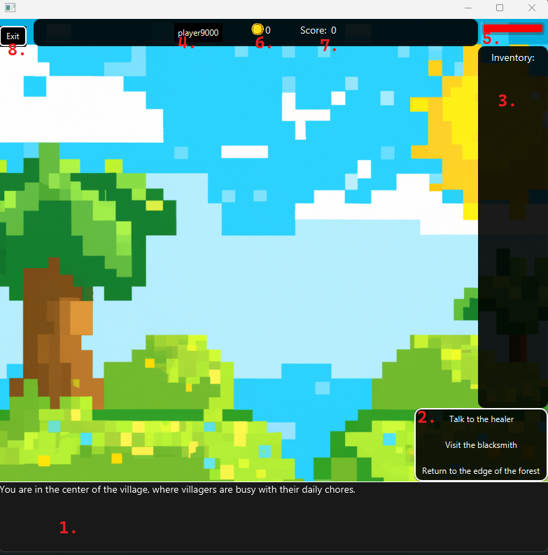

# Paths

Welcome to Paths, a JavaFX adventure game featuring complex functionality and possibilities to make your own stories!

Keep in mind though, it is (currently) a bit complicated.

## Requirements

- Java JDK 17 or higher
- Git
- Maven

## Installation

1. Clone the repository
2. Open a terminal in the repository folder
3. Run 'mvn javafx:run'

## Usage

Run the application and enjoy!

### How to start and play a game

1. In the main menu. Click 'New game' to start a new game or 'Load game' to load a saved game.

2. Select a story to play. The different extensions of the story are shown in the dropdown menu.
   Read more about the extensions in section __))

3. (OPTIONAL) After choosing a story, you can choose custom settings for a game. Goals and Start values can be edited.
   The goals
   will not affect the game, but show you if you reached the goals when you encounter a game ending passage.]

4. Fill in the player name field and click 'Start game'

5. 
   The scene you are now seeing is the games opening passage. It is the first passage of the story and is always shown
   when you start a game.
   See the picture for information of where the objects listed are
    1. Content bar: This bar shows the content of the passage. It is plain text and is animated and can be skipped when
       clicked.
    2. Link choices: This is a list of links that take you to another passage. The links are shown as buttons and can be
       clicked to go to the passage.
       See _____ for additional information on links and the game structure.
    3. Inventory: This is a list of items that you have collected. Items does not currently have any special
       functionality other than being displayed as text or images.
    4. Player name: This is the name of the player. It is shown in the top left corner of the screen.
    5. Health bar: This is the health bar of the player. It is shown in the top right corner of the screen.
    6. Gold: This is the amount of gold the player has. It is shown in the top right corner of the screen.
    7. Score: This is the score of the player. It is shown in the top right corner of the screen.
    8. Exit button: This is the exit button. It is shown in the top right corner of the screen. Clicking it will take
       you back to a dialog where you can save, exit or restart the game.

### How to save and load a game

1. [Add steps here on how to save a game]
2. [Add steps here on how to load a saved game]

### How to debug and read story info

1. [Add steps here on how to debug a game]
2. [Add steps here on how to read story info]   

### How to edit a story

1. [Add steps here on how to edit a story]

### How to create a new story

1. To create a new story, from the main menu, click 'Create your own story'.
2. You will be prompted to choose a name for the story. The name will be used to identify the story in the stories
   overview and will be used as the name of the story file.
   !!Warning!! Using an existent story name will overwrite the previous story file!
3. After choosing a name, you will be taken to the story creator. The story creator is a tool to create stories
   visually. It is recommended to use the story creator to create stories, as it is easier to use than writing the
   story in a text editor. The story will be saved in a json format, which is the recommended format to use.
   It can be converted to a paths format if needed but will lose the additional features of the json format.

#### How to use the story creator

## Game structure

    A story is made up of passages. A passage is a part of the story that is shown to the player. A passage can have
    links to other passages aswell as a mood (only .json stories). A mood is a type which have images and music
    to it. This is used to easily set music and images for a passage.

    Additionally, a passage can have custom images and sounds! See the section __ for more information on how to add
    custom images and sounds to a passage.

    The links in the passage are as mentioned linking to another passage. The links also contains a list of actions
    which can be a change in the players gold, score, health or inventory.
    
    A feature added in version 2.0.0 is a passage being single visit only. This means that the passage can only be
    visited once. This is especially useful for ensuring players arent getting the actions from a passage multiple times
    by revisiting it. And enables the creation of more complex stories where the user can have multiple paths to take
    and the story can be different depending on the path the user takes.

### Game endings

    A game is considered ended when the player reaches a passage with no links. This is a game ending passage and the end
    screen will be shown. Keep in mind, a story can have multiple game endings.

    The game also ends if a player dies (health reaches 0), and a death screen will be shown.

### Story extensions

    A story can have two different file extentions. (.paths and .json). The .paths extension is the original extension
    and the .json extention is the new extension. The .json extension is the recommended extension to use, as it has
    additional features and the story can easily be edited using the story creator.

#### Story type conversion

    A story written in either format can be converted to the new format. This is done by choosing the story in the
    stories overview and clicking the 'Convert' button. The story will then be converted to the other format.
    
    !!Warning!! 
    This will overwrite the story file, so make sure to have a backup of the story before converting it.
    .json stories will also LOSE all additional features which are not supported by the .paths format.

    A story can be converted from .paths to .json aswell. The player will be prompted to choose moods and if the 
    passage only supports a single visit for all passages in the story. The story will then be converted to the .json
    format.

## License

This project is licensed under the MIT License.
